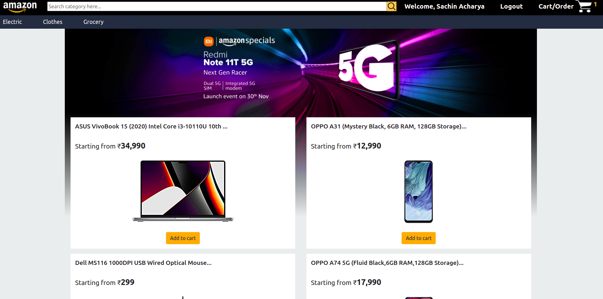

# Amazon Clone

## Overview

I've tried to build an amazon clone with basic function of an e-commerce website such as add/remove item from the cart, section wise category, etc..
Website is build using MERN Stack and redux to achieve optimization in approach.
User Authentication is done through Express Js and Node Js as server.
All shopping item related functions and user information functions are carried out by react-redux or redux store.

## Installation 

### `npm install`

To install all the dependencies tree or node modules.

Note:- Also use this command inside of backend folder to install node modules.
### `npm start`

To start the react app.

### `nodemon ./index.js`

To start the backend server, use this command inside of backend folder and make sure MongoDB is started before initiating this command